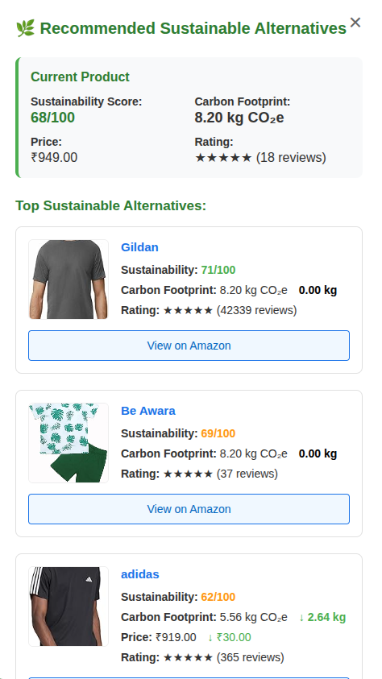
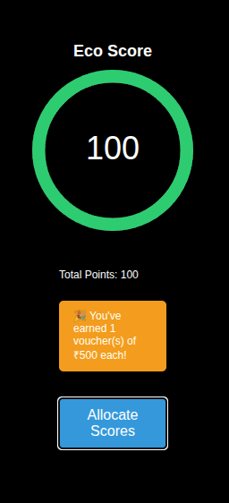
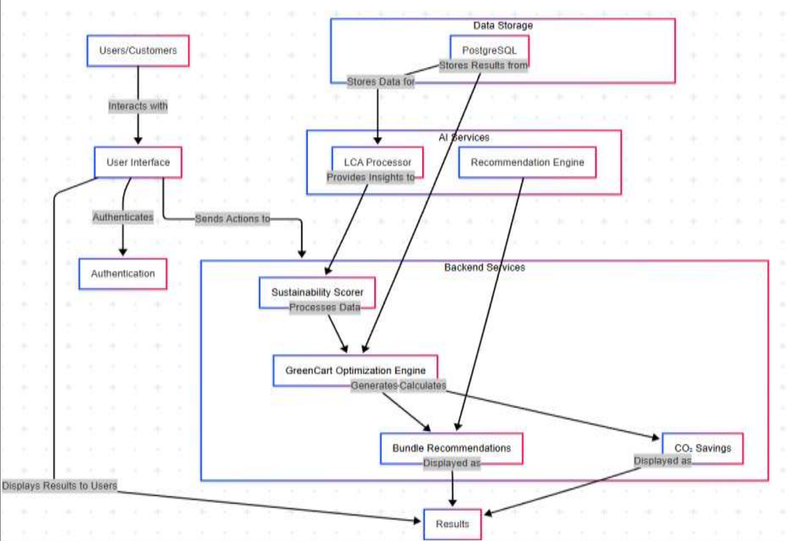

# 🌿 GreenVerse - Make Every Cart a Climate Win

# TEAM-ALGORITHM
SHASHANK SHARMA (TEAM LEAD)<br>
SHUBHAM NEGI <br>
SAKSHAM CHAND<br>
PRIYANSHI BARMOLA<br> 
#
**One‑Click Sustainable Shopping on Amazon.in**


<p align="center">
  
</p>
<p align="center">
  <a href="https://youtu.be/mfoP9NAtgjw" target="_blank">
    
  </a>
  <a href="https://www.canva.com/design/DAGq7kPgJlk/OQ7CqUwVT61TKUqnIX0KcA/edit?ui=eyJEIjp7IlAiOnsiQiI6ZmFsc2V9fX0" target="_blank">
    
  </a>
</p>


## 🌱 Why GreenVerse?
- **Fragmented eco‑data: no single source for CO₂, water & waste metrics**
- **Vague “eco” labels; manual comparison is time‑consuming**
- **Multiple shipments → duplicated packaging & emissions**


## Features
### 🔍 GreenMind  
Instant 0–100 Sustainability Score for every product 

---

### 🔄 Swap — One‑Click Greener Alternative  
  
Click the green “Swap” button to instantly replace a product with a higher‑scoring alternative.  

---

### ♻️ EcoTwin — Side‑by‑Side Lifecycle Comparison  
  
Expand the EcoTwin card to see CO₂, water, and waste metrics for your current product vs. the suggested greener option.  

---

### 📦 GreenCart AI  
Bundle same‑region items for fewer shipments  

### 🏆 Gamification  
  
CO₂ saved dashboard + achievement badges  


## How It Works

1. Scrapes product & cart data from Amazon.in
2. Looks up LCA averages & custom overrides
3. Computes scores, swap & bundling suggestions
4.  Displays in‑page popup with instant actions


## System Architecture



## 🧪 Testing 
```bash
git clone https://github.com/<you>/greenverse-extension.git
```
```bash
cd Greenverse-extension/
```
```bash
node scripts/generateAlternatives.mjs
```
```bash
npm run build
```


## 🤝 Contributing
Issues and pull requests are welcome.

## 📄 License
This project is licensed under the MIT License.


